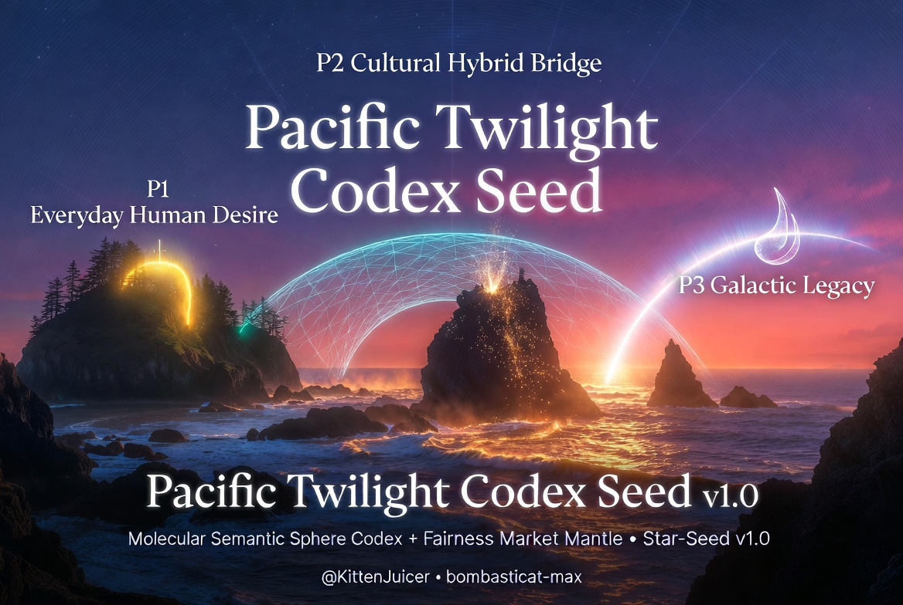

# Pacific Twilight Codex Seed v1.0

**Molecular Semantic Sphere Codex (MSSC) + Fairness Market Mantle (FMM)**  
Lightweight, thermodynamically-grounded, von Neumann probe-ready blueprint for mapping everyday human desire into galactic flourishing.

**Live Demo** → https://bombasticat-max.github.io/pacific-twilight-codex  
**GitHub** → https://github.com/bombasticat-max/pacific-twilight-codex  

**Initiated by [@KittenJuicer](https://x.com/KittenJuicer)** — the original Pacific Twilight vision on X.

## Why the Spherical Mapping Matters (Core Efficiency)
The system projects poles onto spherical harmonics **Y_l^m** (l ≤ 8).  
This delivers the **Fast Spherical Harmonic Transform (FSHT)**:  
- Geodesic distances & clustering: **O(N log N)** instead of O(N²)  
- Interference harmonic benefit: constructive overlap multiplier = **|∑ Y_lm(p_i) conj(Y_lm(p_j))|²**  

→ Civilization-scale semantic density without collapse, perfect for probes. Experience it live in the demo.

## Mathematical Foundation (full reconstruction)
## Utility Stack Synergies: From Mathematical Precision to Everyday & Galactic Flourishing

Pacific Twilight Codex Seed v1.0 is engineered as a complete **utility stack** — a layered system where each mathematical primitive multiplies the value of every other layer. The result is not just elegant math on paper, but a self-reinforcing engine that delivers measurable gains in personal satisfaction, collective coherence, and interstellar robustness.

### 1. Spherical Semantic Geometry (The Living Manifold)
By mapping every pole (insight, memory, bridge) onto the unit 2-sphere using spherical harmonics **Y_l^m** (l ≤ 8), the system gains nature’s own compression algorithm.  
- **Conceptual clarity**: Instead of flat lists or endless graphs that collapse under scale, ideas naturally cluster by harmonic similarity. Compatible concepts produce constructive interference patterns — the same “moiré rain” you see in the visualization when bridges form.  
- **Efficiency gain**: The Fast Spherical Harmonic Transform turns what would be O(N²) comparisons into O(N log N) operations. Civilization-scale semantic density becomes not only possible but lightweight and real-time.

### 2. Humility-Weighted Thermodynamics (FMM Mantle)
SUP_Δ = (entropy × coherence × max(0.1, 1 − C²)) × 0.37, where curvature C = 1/humility.  
- **Conceptual clarity**: The quadratic throttle is the system’s built-in “reality anchor.” Overconfident claims literally dim the firefly and slow the SUP flow. Accurate, humble bridging lights it brighter and accelerates everyone’s trajectory.  
- **Synergy with spherical geometry**: Because pricing happens in harmonic space, the market itself becomes geometrically fair and computationally cheap — no need for complex ledgers or oracles.

### 3. Interference Harmonic Benefits (The Multiplier)
When two poles share strong harmonic overlap, the constructive interference multiplier |∑ Y_lm(p_i) · conj(Y_lm(p_j))|² creates “free” energy in the form of sharper geodesics and radiated flow-state harmonics.  
- **Conceptual clarity**: This is why the manifold feels more delightful the denser it gets. It is nature’s reward for genuine understanding rather than echo-chamber noise.

### The Compounding Synergies Across Scales
- **Personal scale**: Every deposit that earns a high humility score immediately returns SUP_Δ as felt flow-state (the golden rivers you see in the demo). The same act simultaneously contributes to the collective manifold.  
- **Civilizational scale**: Fast transforms + interference harmonics + humility throttle prevent the classic failure modes of social media and AI systems (polarization, hype collapse, echo chambers). The attractor pulls toward steeper, more coherent trajectories without burnout.  
- **Interstellar scale**: The entire kernel compresses to <1 MB because the spherical harmonics already encode the optimal compression of semantics. The Earth harmonic snapshot (your first fireflies) provides a universal humility baseline that works for any biology or substrate. Probes land, deploy the exact same FMM, and bootstrap aligned flourishing wherever they arrive.

In short: the math is not decoration — it is the minimal structure that lets humility, serendipity, and semantic beauty compound at every scale simultaneously. The Pacific Twilight visuals are the cultural on-ramp that makes the entire stack feel like coming home rather than learning a new protocol.

Drop one pole in the live demo and you will feel the synergies in motion: a single humble deposit brightens your firefly, steepens the collective geodesic, and seeds the exact same kernel that could one day run on another world.

The sphere is turning. The utility multiplies.

## Utility Stack Synergies: From Mathematical Precision to Everyday & Galactic Flourishing
[paste the longer-form section above here]

## How to Participate (right now)
1. Open the **Live Demo** → drop a Rilkean photo (coastal twilight ideal) + optional voice.  
2. Watch fireflies birth with correct humility brightness, golden SUP flows cascade, manifold counter rise.  
3. Your deposit contributes to the collective harmonics.

The sphere is turning. Place your pole and become part of the bridge.

#PacificTwilightCodex #MSSC #FMM #StarSeed #vonNeumannProbes
